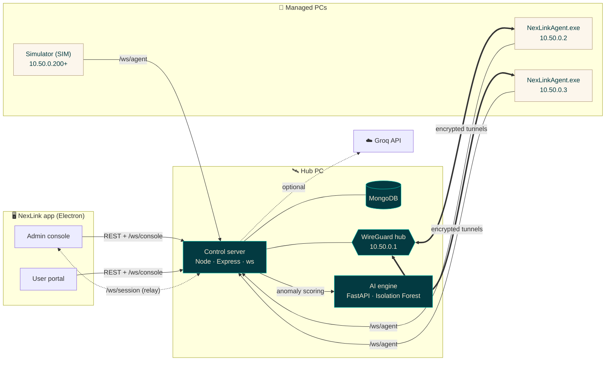
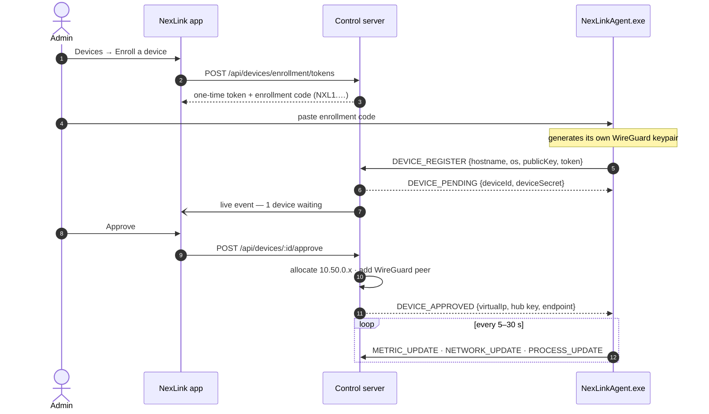
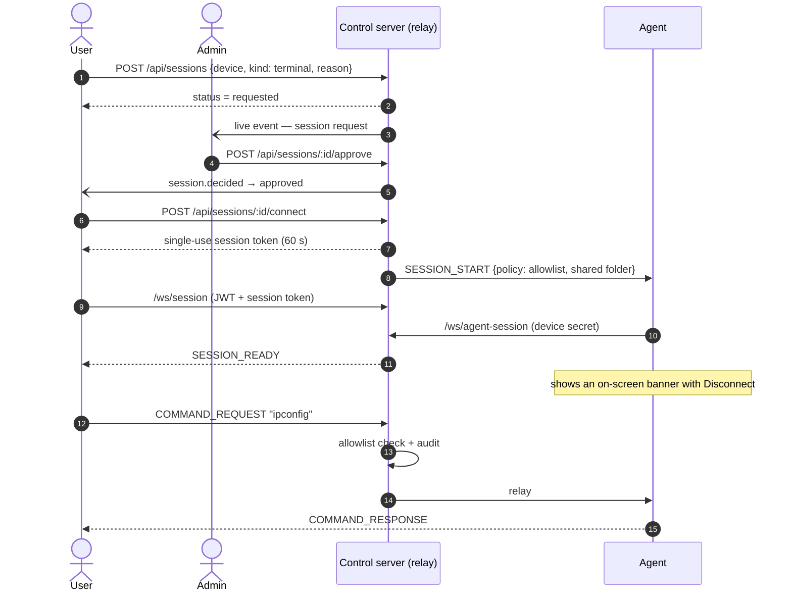
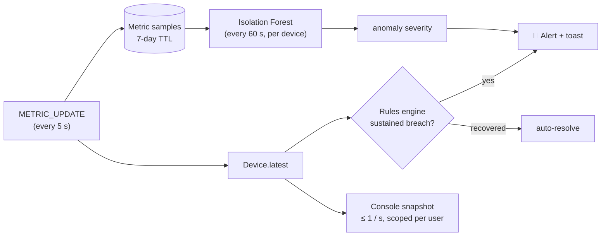
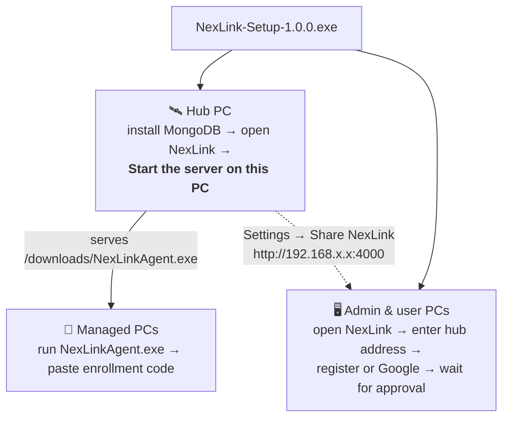

<div align="center">


<br />

**Connect a private group of machines into one encrypted network, monitor them live, and give approved people remote access — with every action audited.**

<br />


[Features](#-features) ·
[Architecture](#-architecture) ·
[Quick start](#-quick-start) ·
[Deploy & share](#-deploy--share) ·
[Security](#-security-model) ·
[API](#-api-reference) ·
[Docs](#-documentation)

</div>

---

## 📖 Overview

NexLink is a desktop platform for **remote access and network management** of a group of
Windows PCs, such as a lab, an office or a small team. It has three parts:

| | Component | Runs on | Role |
|:-:|---|---|---|
| 🖥️ | **NexLink app** (Electron + React) | Admins' and users' PCs | Admin console *or* user portal. On one PC it can also **host the server**. |
| 🛰️ | **Control server** (Node + MongoDB) | The hub PC | Accounts, devices, telemetry, sessions, alerts, AI. Also the **WireGuard hub** (`10.50.0.1`). |
| 🧩 | **NexLink Agent** (`NexLinkAgent.exe`, Python) | Every managed PC | Enrolls with a one-time code, reports metrics and serves remote sessions. It is **visible by design**. |

> [!NOTE]
> Nothing in the UI is mocked. Demo devices come from a **simulator** that speaks the exact same
> protocol and is clearly labelled **SIM**, so the whole system can be shown on a single laptop.

---

## ✨ Features

<table>
<tr>
<td width="50%" valign="top">

### 🌐 Network & VPN
- Hub-and-spoke **WireGuard** network (`10.50.0.0/24`)
- Keys generated on each device; **private keys never leave it**
- Live **topology map**, tunnel handshakes and transfer
- ICMP **latency and loss** bursts plus **app-level RTT**
- Honest **simulated mode** when WireGuard isn't installed

### 🖱️ Remote administration
- **Remote desktop**: JPEG stream, mouse and keyboard, adaptive quality
- **File manager**: chunked transfers, **SHA-256 verified**
- **Terminal**: safe allowlist for users, confirmed **full shell** for admins
- On-device **banner with Disconnect** during every session

</td>
<td width="50%" valign="top">

### 📊 Monitoring & analysis
- CPU / RAM / disk / network every **5 s**, processes and connections every **15 s**
- **Traffic** history (15 min – 7 days) and top talkers
- Protocol distribution, remote hosts, **risky open ports**
- **Alerts** with sustained-breach rules, acknowledge / resolve / auto-resolve

### 🤖 Intelligence
- Per-device **Isolation Forest** anomaly detection (with a z-score fallback)
- **AI assistant** (Groq tool calling), scoped to what each user may see
- Offline, rule-based diagnosis when no API key is set
- Daily / weekly **health reports** with an AI summary, printable to PDF

</td>
</tr>
<tr>
<td valign="top">

### 🔐 Access control
- **Admin** and **User** roles with **separate portals**
- Email + password **and Google sign-in** (RFC 8252 loopback)
- Self-registration → **admin approval**
- Users see **only assigned devices**; their sessions need approval

</td>
<td valign="top">

### 📦 Distribution
- One **Windows installer** containing the console *and* the server (host mode)
- **Standalone agent `.exe`**, served by the hub for download
- Single **enrollment code** (server address + token) to paste
- Appearance: **Cream** or **Deep teal** theme

</td>
</tr>
</table>

---

## 🏗️ Architecture



### Communication channels

| Channel | Authentication | Carries |
|---|---|---|
| `REST /api/*` | Bearer JWT, bound to a revocable server-side session | CRUD, approvals, queries |
| `WS /ws/console` | JWT in the **first frame** (never in the URL) | Per-user snapshots, live events, PING/PONG RTT |
| `WS /ws/agent` | Enrollment token → device secret (stored as SHA-256) | Registration, telemetry, commands, PING/PONG |
| `WS /ws/session` ⇄ `/ws/agent-session` | JWT + **single-use 60 s** session token / device secret | Desktop frames, input, files, terminal |

Every text frame uses one envelope:
`{ version, messageId, type, deviceId, sessionId, timestamp, payload }`.
Binary frames carry screen JPEGs (`0x01`) and file chunks (`0x02`).

### Device enrollment



### Remote session with approval



### Monitoring pipeline



---

## 👥 Roles

| Capability | 🛡️ Admin | 👤 User |
|---|:-:|:-:|
| See devices | All | Only assigned |
| Remote desktop / files / terminal | Immediately | After admin approval |
| Terminal mode | Allowlist or confirmed full shell | Allowlist only |
| File access | Whole disk | Device's *NexLink Shared* folder |
| Approve devices, users and sessions | ✅ | — |
| VPN, alerts, reports, audit log, settings | ✅ | — |
| AI assistant | All data | Own devices only |

---

## 🚀 Quick start

### Prerequisites

| Tool | Version | Used for |
|---|---|---|
| [Node.js](https://nodejs.org) | 20+ | Server, desktop app, tooling |
| [MongoDB Community](https://www.mongodb.com/try/download/community) | 7+ (runs as a service) | Data store |
| [Python](https://python.org) | 3.10+ | Agent, simulator, AI engine |
| [WireGuard](https://www.wireguard.com/install/) | optional | Real encrypted tunnels |

### Run from source

```bash
git clone <your-repo-url> nexlink && cd nexlink
```

```bash
npm install
```

```bash
pip install -r apps/agent/requirements.txt -r apps/ai-engine/requirements.txt
```

```bash
cp apps/server/.env.example apps/server/.env
```

```bash
npm run dev
```

`npm run dev` starts the server on `:4000` plus the desktop app with hot reload. On first launch,
create the administrator account; there are no default passwords.

### See it working in 2 minutes

```bash
npm run demo
```

This starts 5 simulated PCs. In the app, open **Devices → Pending approval** and approve them. On
any device page, **Simulate a fault → Packet loss** raises an alert in about 30 seconds.

### Useful scripts

| Command | What it does |
|---|---|
| `npm run dev` | Server + desktop app with hot reload |
| `npm test` | 31 automated tests (protocol, auth/roles, Phases 2–7 with an in-process fake agent) |
| `npm run demo` | Start simulated devices against the local server |
| `npm run e2e` | 31 end-to-end checks against a running server with real simulated agents |
| `npm run ai-engine` | Isolation Forest service on `127.0.0.1:8000` |
| `npm run build:agent` | Build `apps/agent/dist/NexLinkAgent.exe` (PyInstaller) |
| `npm run dist` | Agent + `NexLink-Setup-1.0.0.exe` in `apps/desktop/release/` |

---

## 📦 Deploy & share



1. **Hub:** install MongoDB, then the NexLink installer. Choose **Start the server on this PC**.
   Allow NexLink through the Windows Firewall on private networks (TCP 4000).
2. **People:** install the NexLink app and enter the address from **Settings → Share NexLink**.
   Approve them as *user* or *admin* under **Users**.
3. **Devices:** in **Devices → Enroll a device**, send the download link and the enrollment code.
   Approve the device when it appears.

Optional integrations, all configurable in **Settings**:

| Integration | How |
|---|---|
| 🔑 Google sign-in | Google Cloud → OAuth client of type **Desktop app** → paste the client ID and secret. No redirect URIs needed. |
| 🤖 Groq AI | Paste an API key from [console.groq.com](https://console.groq.com/keys). It is stored encrypted. |
| 🔒 WireGuard | **VPN → Write hub config** → run the shown commands as Administrator → **Re-detect**. |

Full guide: **[docs/INSTALL.md](docs/INSTALL.md)**.

---

## 🔐 Security model

| Area | Measure |
|---|---|
| Passwords | bcrypt (12 rounds); policy of 10+ characters with letters and digits; lockout after 5 failures; rate-limited credential endpoints |
| Sessions | JWT bound to a server-side session, so logout, disable and role changes take effect instantly; stored with OS encryption (`safeStorage`) |
| Accounts | Self-registration and Google sign-ups start **pending**; no default credentials; first-run setup is race-safe |
| Google | PKCE + `state`; the ID token is verified (signature, audience, expiry, `email_verified`) on the server |
| Devices | One-time, expiring, hashed enrollment tokens; per-device secret stored as SHA-256; WireGuard private keys never leave the device; agent secrets DPAPI-encrypted |
| Remote access | Single-use 60 s session tokens; allowlist enforced on **server and agent**; shared-folder jail for users; visible banner with local Disconnect |
| Data scoping | `deviceScope(user)` applied to every device, metric, alert, session, traffic, analysis and AI query |
| Secrets at rest | Groq key and Google client secret encrypted with AES-256-GCM |
| Audit | Append-only collection: logins, approvals, commands, file transfers, AI questions, settings changes |
| Desktop shell | `contextIsolation`, `sandbox`, no `nodeIntegration`, validated IPC with a trusted-sender check, CSP, blocked navigation |

---

## 🔌 API reference

<details>
<summary><b>REST endpoints</b> (click to expand)</summary>

| Method | Path | Access |
|---|---|---|
| `GET` | `/api/health` | public |
| `GET` | `/api/auth/status` | public |
| `POST` | `/api/auth/setup` · `/login` · `/register` | public, rate-limited |
| `POST` | `/api/auth/google/start` · `/google/exchange` | public, rate-limited |
| `GET` `PATCH` | `/api/auth/me` | signed in |
| `POST` | `/api/auth/logout` | signed in |
| `GET` `POST` `PATCH` `DELETE` | `/api/users[/:id]` | admin |
| `GET` | `/api/devices` · `/api/devices/:id` · `/:id/metrics` | scoped |
| `POST` | `/api/devices/:id/approve` · `/reject` · `/sim-fault` | admin |
| `PATCH` `DELETE` | `/api/devices/:id` | admin |
| `POST` | `/api/devices/:id/diagnostics` | scoped |
| `GET` `POST` `DELETE` | `/api/devices/enrollment/tokens[/:id]` | admin |
| `GET` `POST` | `/api/sessions` · `/:id/connect` · `/:id/end` | scoped |
| `POST` | `/api/sessions/:id/approve` · `/deny` | admin |
| `GET` | `/api/alerts` | scoped |
| `POST` | `/api/alerts/:id/ack` · `/resolve` · `/ack-all` | admin |
| `GET` | `/api/network` · `/api/vpn` · `/api/traffic` · `/api/analysis` | scoped |
| `POST` | `/api/vpn/refresh` · `/api/vpn/hub-config` | admin |
| `GET` `POST` | `/api/ai/status` · `/api/ai/chat` | signed in, rate-limited |
| `GET` `POST` `DELETE` | `/api/reports[/:id]` | admin |
| `GET` `PATCH` | `/api/settings` | admin |
| `GET` | `/api/audit` | admin |
| `GET` | `/downloads/NexLinkAgent.exe` | public |

</details>

<details>
<summary><b>Protocol message types</b></summary>

| Group | Types |
|---|---|
| Auth & enrollment | `AUTH_REQUEST` `AUTH_RESPONSE` `DEVICE_REGISTER` `DEVICE_PENDING` `DEVICE_APPROVED` `DEVICE_REJECTED` |
| Telemetry | `HEARTBEAT` `METRIC_UPDATE` `NETWORK_UPDATE` `PROCESS_UPDATE` |
| Measurement | `PING` `PONG` |
| Sessions | `SESSION_START` `SESSION_READY` `SESSION_END` `SESSION_STATS` `REMOTE_INPUT` `FILE_REQUEST` `FILE_RESPONSE` `COMMAND_REQUEST` `COMMAND_RESPONSE` |
| Console push | `STATE_SNAPSHOT` `EVENT` `ERROR` |

</details>

---

## 🗂️ Project structure

```text
nexus-rmc/
├── packages/
│   └── protocol/            # Shared envelope, message types, terminal allowlist, port map (+ tests)
├── apps/
│   ├── server/              # Express + ws + Mongoose control server
│   │   ├── src/
│   │   │   ├── routes/      # auth, users, devices, sessions, alerts, network, intel (AI, reports, settings)
│   │   │   ├── websocket/   # consoleHub, agentHub, sessionHub (relay)
│   │   │   ├── services/    # wireguard, alerts, anomaly, ai, sessions, google, settings, audit
│   │   │   └── models/      # User, Device, Telemetry (metrics, alerts, sessions, tokens, reports)
│   │   ├── scripts/         # demo, e2e-smoke, exe-smoke
│   │   └── test/            # phase1 + phases integration tests
│   ├── desktop/             # Electron main (host mode, Google loopback) + React/Vite/Tailwind UI
│   │   ├── electron/        # main.cjs, preload.cjs, hub.cjs
│   │   └── src/             # pages, components, stores, services, design tokens
│   ├── agent/               # Python agent + simulator → NexLinkAgent.exe
│   └── ai-engine/           # FastAPI + scikit-learn Isolation Forest
├── docs/                    # install, user guide, demo script, architecture, design decisions, brand
└── launch-nexus.ps1         # one-click launcher (dev install)
```

---

## 🧪 Testing

```bash
npm test
```

This runs 4 protocol tests, 14 foundation tests (auth, roles, audit, WebSocket), and 13 tests for Phases 2–7:
- enrollment and approval, telemetry and alerts, device scoping, diagnostics;
- the session approval and relay, including a blocked command and single-use token replay;
- AI and reports, and the anomaly detector.

End to end, run the next two commands in separate terminals. The first starts a throwaway server:

```bash
PORT=4001 MONGODB_URI=mongodb://127.0.0.1:27017/nexlink_e2e node apps/server/src/index.js
```

```bash
node apps/server/scripts/e2e-smoke.mjs http://127.0.0.1:4001
```

The second runs 31 checks with 3 real simulated agents.

---

## 🎨 Design system

| Token | Colour | Use |
|---|---|---|
| Deep Teal |  | Structure, navigation, primary buttons |
| Aqua Teal |  | Interaction, online, connections, charts |
| Warm Cream |  | Main background |
| Warm Taupe |  | Neutral, borders, offline |
| Warm Gold |  | Warnings, latency, secondary emphasis |

All colours are centralised tokens in `apps/desktop/src/styles/index.css`, with Cream and Deep teal themes.

---

## 📚 Documentation

| Document | Contents |
|---|---|
| [docs/INSTALL.md](docs/INSTALL.md) | Hub setup, sharing with users, enrolling devices, Google, Groq, WireGuard, troubleshooting |
| [docs/USER_GUIDE.md](docs/USER_GUIDE.md) | Every screen of the admin console and the user portal |
| [docs/DEMO.md](docs/DEMO.md) | A 10-minute presentation script |
| [docs/ARCHITECTURE.md](docs/ARCHITECTURE.md) | Components, channels, session flow, data scoping |
| [docs/DESIGN_DECISIONS.md](docs/DESIGN_DECISIONS.md) | Why things are built the way they are (D1–D15) |

---

## 🗺️ Roadmap

- [x] Foundation, agent, VPN, remote administration, network analysis, AI/ML, hardening, packaging
- [ ] Code-signed installers (removes the Windows SmartScreen prompt)
- [ ] macOS / Linux agent packages
- [ ] TLS on the hub (`https://` / `wss://`) with a bundled certificate helper
- [ ] Multi-monitor selection in remote desktop

---

<div align="center">
<br />
<sub><b>NexLink</b> · Secure infrastructure for connecting and managing remote devices</sub>
</div>
